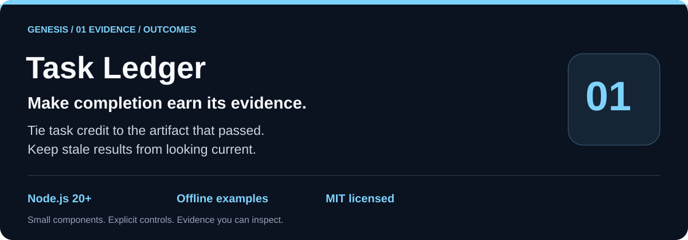
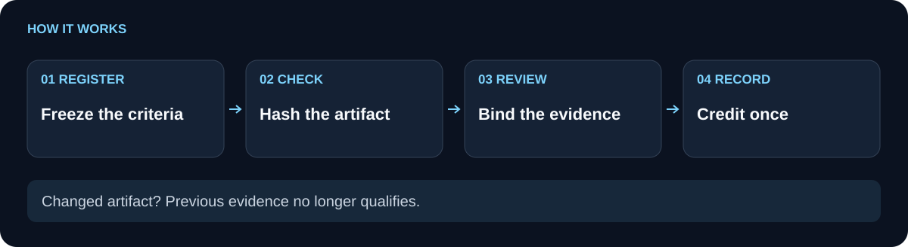

# genesis-task-ledger

 

`genesis-task-ledger` turns a preregistered task into a durable acceptance record. It binds every criterion to a passing check, verifies each artifact against its current SHA256, and requires a distinct configured reviewer to accept the exact check and artifact digests before the outcome is accepted. A task can earn one deduplicated credit; later receipts remain evidence without minting another credit.

**Immutable task contracts.** **Current artifact evidence.** **Durable reviewed outcomes.**

[Use cases](#use-cases) · [How it works](#how-it-works) · [Quickstart](#quickstart) · [API](#api) · [Comparison](#comparison) · [Limitations](#limitations) · [Related components](#related-components)

## Use cases

Use the ledger when a workflow needs to answer “what was accepted, against which criteria, and from which files?” Examples include build packets with a reviewer receipt, offline research results with checked source files, and a local acceptance gate whose latest artifact version must remain valid after reload.

In a fictional release run, the team previously marked a JSON export “done” in a shared note, then discovered that the file had changed after review. With the ledger, the export is preregistered, checked against its current digest, and accepted only when the reviewer receipt names the same evidence.

Use simpler code when a single script only needs a local boolean or a one-off assertion and no one needs to reload, audit, or review the result.

## How it works

<picture>
  <source media="(max-width: 600px)" srcset="docs/flow-compact.svg">
  
</picture>

The workflow is: preregister an ID, objective, and one to fifty criteria; record one passing check for every criterion; attach one to twenty nonempty files under `artifactRoot`; then submit the worker receipt and an independent configured reviewer receipt. `evaluate(taskId)` checks the latest recorded outcome, re-verifies its files, and rejects stale, changed, unavailable, or superseded evidence.

The diagram shows evidence moving through the ledger. The arrows describe the checks performed by `recordOutcome`; the final evaluation is based on the latest outcome, so a later authority failure or changed artifact can invalidate an earlier acceptance. State is written to `ledger.json` with an atomic temporary-file rename.

## Quickstart

```sh
git clone https://github.com/Wassimyounes01/genesis-task-ledger.git
cd genesis-task-ledger
npm test
npm run demo
```

Node.js 20 or newer is required. The package has no runtime dependencies, so the commands above need no `npm install`. The demo creates a temporary artifact, preregisters a task, records a bound check and reviewer, prints the accepted result, and removes its temporary directory.

## API

```js
const fs = require('node:fs');
const { createLedger, sha256, checksDigest, artifactsDigest } = require('./index.cjs');

const ledger = createLedger({ stateDir: './state', artifactRoot: './artifacts' });
const { task } = ledger.preregister({
  id: 'task-1',
  objective: 'verify a bounded result',
  criteria: [{ id: 'json-valid', description: 'the result is valid JSON' }],
});

const proof = { path: 'result.json', sha256: sha256(fs.readFileSync('./artifacts/result.json')) };
const checks = [{
  taskId: task.id, acceptanceDigest: task.acceptanceDigest,
  criterionId: 'json-valid', checkId: 'parse-json', passed: true,
  command: 'node parse-json.cjs', exitCode: 0, checkedCount: 1, expectedCount: 1,
  artifacts: [proof],
}];

ledger.recordOutcome({
  taskId: task.id, workerId: 'worker-1', checks, artifacts: [proof],
  reviewer: {
    id: 'reviewer-1', taskId: task.id, acceptanceDigest: task.acceptanceDigest,
    configured: true, independent: true, verdict: 'accept',
    checksDigest: checksDigest(checks), artifactsDigest: artifactsDigest([proof]),
  },
});
```

The public exports are `TaskLedger`, `createLedger`, `sha256`, `digest`, `checksDigest`, and `artifactsDigest`. The complete input schema, including bounds and optional `completedAt` and `revisionId`, is in [module-manifest.json](module-manifest.json). [examples/demo.cjs](examples/demo.cjs) is the smallest fully runnable integration.

## Comparison

| Workflow need | A hand-written status flag or receipt | `genesis-task-ledger` |
| --- | --- | --- |
| Define acceptance before execution | Usually implicit or mutable | Preregistered objective and criteria produce an immutable `acceptanceDigest` |
| Tie checks to files | Often a filename or prose note | Each check and outcome carries exact `{path, sha256}` proofs under a caller-selected root |
| Review the same evidence | Review state can drift from the checked result | Reviewer digests must match the complete checks and artifact proofs |
| Reuse after restart | Depends on external bookkeeping | Local `ledger.json` is reloaded and evaluated against current files |
| Repeat an accepted task | Replays may look like new wins | Duplicate receipts return `duplicate: true`; credit is stored once per task |

## Limitations

The ledger is local and synchronous; use an external lock when multiple processes write the same state directory. Reviewer configuration and independence are caller-attested, not cryptographically authenticated. The ledger verifies files and receipt structure but does not run the check command, supervise a worker, prove that a reviewer actually inspected the artifact, or provide distributed consensus. Artifact paths are bounded to `artifactRoot`, and individual artifacts and state have size limits. Evaluation considers only the latest outcome, so a changed artifact, stale result, regression, or recorded authority failure does not fall back to an older accepted result.

The test suite exercises fresh acceptance and reload, duplicate credit, stale and changed artifacts, immutable criteria, authority failures, symlink escapes, cross-task replay, size bounds, atomic rollback, and exact receipt binding. Run `npm test` to verify those behaviors locally.

## Related components

- [genesis-plan-graph](https://github.com/Wassimyounes01/genesis-plan-graph) validates dependencies and selects a capacity-bounded ready wave.
- [genesis-task-adaptation](https://github.com/Wassimyounes01/genesis-task-adaptation) records feedback and durable recheck requirements.
- [genesis-context-graph](https://github.com/Wassimyounes01/genesis-context-graph) matches current, source-backed context cards.
- [genesis-worker-router](https://github.com/Wassimyounes01/genesis-worker-router) routes injected providers under deadlines and caps.
- [genesis-suite](https://github.com/Wassimyounes01/genesis-suite) integrates the public modules.
