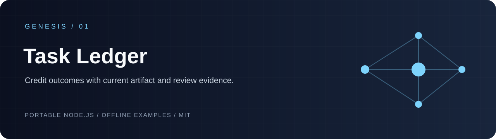
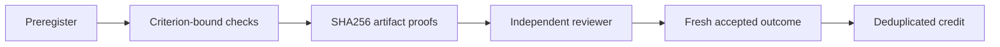

# genesis-task-ledger

 

`genesis-task-ledger` turns a preregistered task into an auditable acceptance record: every criterion is bound to a passing check, every artifact is hashed from disk, and a distinct independent configured reviewer must accept the exact check and artifact digests before a fresh result can earn one deduplicated credit.



## Run locally

```sh
git clone https://github.com/Wassimyounes01/genesis-task-ledger.git
cd genesis-task-ledger
npm test
npm run demo
```

No dependency installation is required. The complete runnable setup is in [examples/demo.cjs](examples/demo.cjs); API snippets illustrate integration shapes.


Use it for bounded build packets, evidence-backed research receipts, or offline workflow experiments where “finished” must remain distinct from “verified.”

## API and five-minute offline start

```js
const { createLedger, sha256, checksDigest, artifactsDigest } = require('./index.cjs');
const ledger = createLedger({ stateDir: './state', artifactRoot: './artifacts' });
const { task } = ledger.preregister({ id: 'task-1', objective: 'produce a result', criteria: [{ id: 'works', description: 'result passes' }] });
const taskAcceptanceDigest = task.acceptanceDigest;
const proof = { path: 'result.json', sha256: sha256(require('node:fs').readFileSync('./artifacts/result.json')) };
ledger.recordOutcome({
  taskId: 'task-1', workerId: 'worker-1', checks: [{ taskId: 'task-1', acceptanceDigest: taskAcceptanceDigest, criterionId: 'works', checkId: 'check-1', passed: true, command: 'node verify.cjs', exitCode: 0, checkedCount: 1, expectedCount: 1, artifacts: [proof] }],
  artifacts: [proof], reviewer: { id: 'reviewer-1', taskId: 'task-1', acceptanceDigest: taskAcceptanceDigest, configured: true, independent: true, verdict: 'accept', checksDigest: checksDigest([{ taskId: 'task-1', acceptanceDigest: taskAcceptanceDigest, criterionId: 'works', checkId: 'check-1', passed: true, command: 'node verify.cjs', exitCode: 0, checkedCount: 1, expectedCount: 1, artifacts: [proof] }]), artifactsDigest: artifactsDigest([proof]) }
});
```

Run `npm test` and `npm run demo` without installing dependencies.

The exact export and input schema is in [module-manifest.json](module-manifest.json).

## Invariants and limitations

The preregistered objective and criteria are immutable. Each check receipt needs a task ID, acceptance digest, command, exit code `0`, positive matching checked/expected counts, and the exact task artifact proofs. SHA256 is computed from the current bounded local file, and paths are confined to the caller’s `artifactRoot`. Results outside the freshness window, missing a criterion, missing evidence, authority violations, regressions, or lacking a distinct independent configured reviewer are rejected. The reviewer’s acceptance binds the complete check receipts and exact artifact digests. Credit is deduplicated by task, so later distinct outcomes cannot mint another credit. Evaluation considers only the latest recorded outcome; stale or changed evidence does not fall back to an older result. Reviewer identity is caller-attested, not cryptographically proven. This module is a ledger, not a policy engine or distributed consensus service.

See the adjacent components [genesis-plan-graph](https://github.com/Wassimyounes01/genesis-plan-graph), [genesis-task-adaptation](https://github.com/Wassimyounes01/genesis-task-adaptation), [genesis-context-graph](https://github.com/Wassimyounes01/genesis-context-graph), and the integrated suite at [Genesis Suite](https://github.com/Wassimyounes01/genesis-suite).
